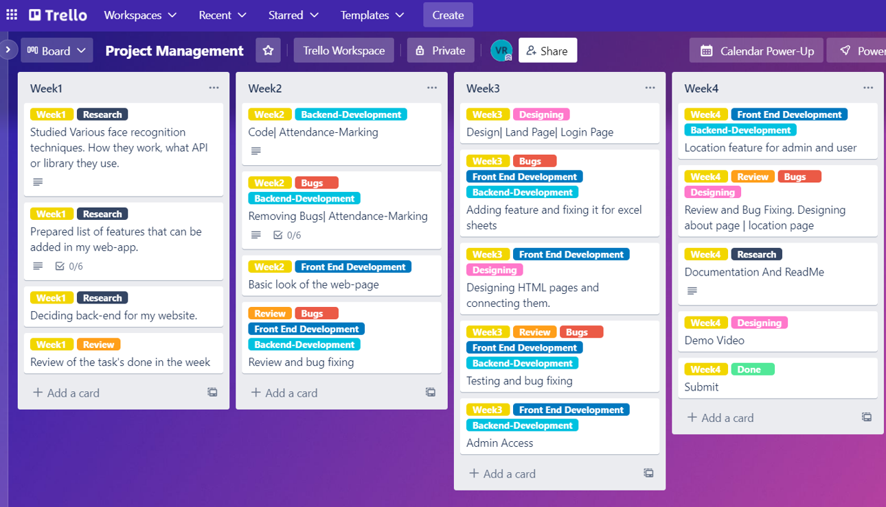
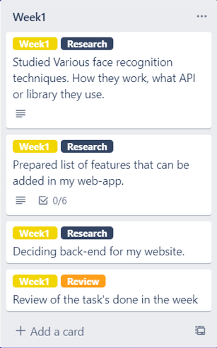
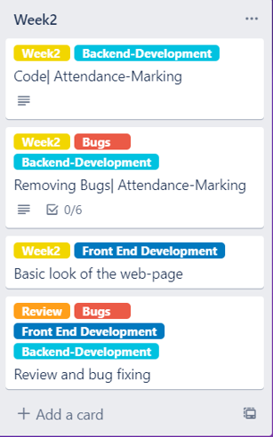
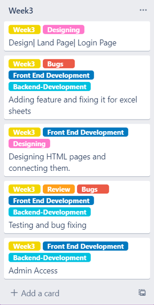
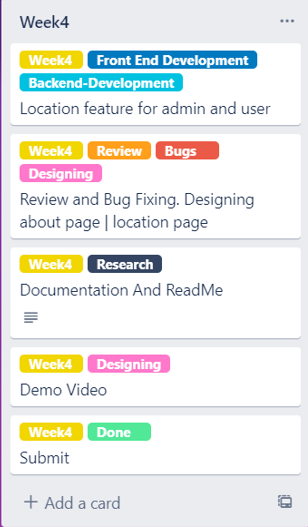
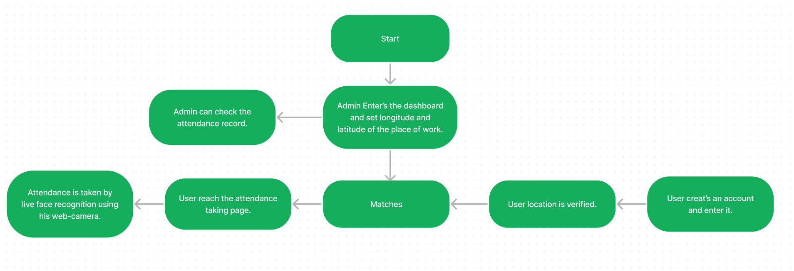

# Attendance Tracker

The attendance tracker attempts to bring features to the existing attendance management web apps.This project was built as a part of the Microsoft Engage Program 2022, where mentees had to make an attendance management system using the face recognition technique.

**Motivation**:False Attendance is one of the major problems faced by universities and industry. Thus to tackle that, we need a system like Attendance Tracker.

**Solved Problem**: Through this web app, we can easily detect all the false attendance by utilizing the power of python and javascript.

**Learnings**: Through the Microsoft Engage Mentorship Program 2022 under the able guidance of my mentor-Pranjal Agnihotri sir, I was able to go from a person who just knew how to make static web pages to a person who can build and deploy a full stack web applications.
# Table Of Contents
- Features Of The Application
- Installation
- Tech Stack Used
- Challanges Faced
- Bug log
- Contact

# Features Of The Application
   - Login
   - Sign Up
   - Sign Out
   - Admin Access To Set Location Of Work
   - User Location Detection
   - Admin Location Detection
   - Attendance Log
   - Option To Clear The Attendance Record by Admin
   - Attendance Marking For Arrival And Departure
   - Automatically captures the attendance.(No need to press any button to close the web camera)
   
# Installation

To use this project follow the steps below:

- Python version: I am using is 3.8.7

Installation git on your terminal.
```bash
git init
```
Clone this repository.
```bash
git clone https://github.com/VaibhavRajpal/Attendance-Tracker-Engage-2022.git
```
Change the directory.
```bash
cd Attendance-Tracker-Engage-2022
```
Open the repository with your code editor. In case you do not have a code editor, it is recommended you use Visual Studio Code.
```bash
code .
```
OR

You can continue in Command Prompt also.

**This web-app uses dlib library also and to download that [Visit Website](https://visualstudio.microsoft.com/downloads/) and download "Visual Studio Community Version" and during installation select "Desktop development with C++" and install it finally.** 


Now Install all the required libraries by running the following Command
```bash
python3 -m pip install -r requirements.txt
```
In some systems all modules are not downloaded from the requirments.txt file so for them one have to manually install all the modules missing that are being told by the terminal (there are a total of 8-9 modules only in requirements.txt) using the command:
```bash
pip install <name of missing module as told by terminal>
```
Finally run the web-app by:
```bash
python3 app.py
```

Now your web-app is deployed at https://127.0.0.1:5000 or the server mentioned in the command line to access the webpage .

Just type 127.0.0.1:5000 in the address bar of your chrome and web-app would start working

- Admin Access Credentials:

   **Username: "admin"**
   
   **Password: "ms-engage"**


# Tech Stack Selection
In spite of all the smart devices that exist today in the world, one thing that is common is - web and internet browsers. I selected my application to be a web application so that a large number of users are able to use it.

For frontend development, I have used HTML, CSS,Javascript and Bootstrap. For backend development, I have used Flask(Python).

 - Using Trello for managing my work:











# Architecture


# Challenges Faced
"Smooth seas do not make skillful sailors"

During the development process I faced the following challenges:

1 . Understanding the working of the backend side of my application as I had never worked with web backend before. However, thanks to online communities, stackoverflow, my mentors and friends I was able to find resources which helped me in creating this web application.

2  .Preparing a feature list. In the beginning I wanted to build an app like no other and incorporate many features. But in the interest of time, I had to narrow down the features to the basic functionalities that are available in a video conferencing web application.

All these challenges were less of challenges and more of lessons, lessons to help me have an even better development process in the future.

# Future Scope
The web application can be improved by adding the following features.
- Adding the feature to detect eye blinking quickly ensures that an actual human is there instead of his photo if they lend their device to someone to verify the location.
- Dashboard for each user to have a track of their attendance record.
- Dashboard for admin to check at which time or during which professor the attendance is maximum.
- Email notification for users when their attendance is marked.

# Bug Log

Following are the known bugs of the web application:

- The web application will work on mobile devices but isn't made responsive to cater to different sizes.
- Sometimes attendance is not marked for departure at once.It is used twice to mark the attendance.
- The UI page for the attendance record can be made more attractive.
- When admin clear's the attendance sheet for the day a blank page is displayed instead it should go to the record page.

# Contact

E-Mail: vaibhavrajpal26@gmail.com
